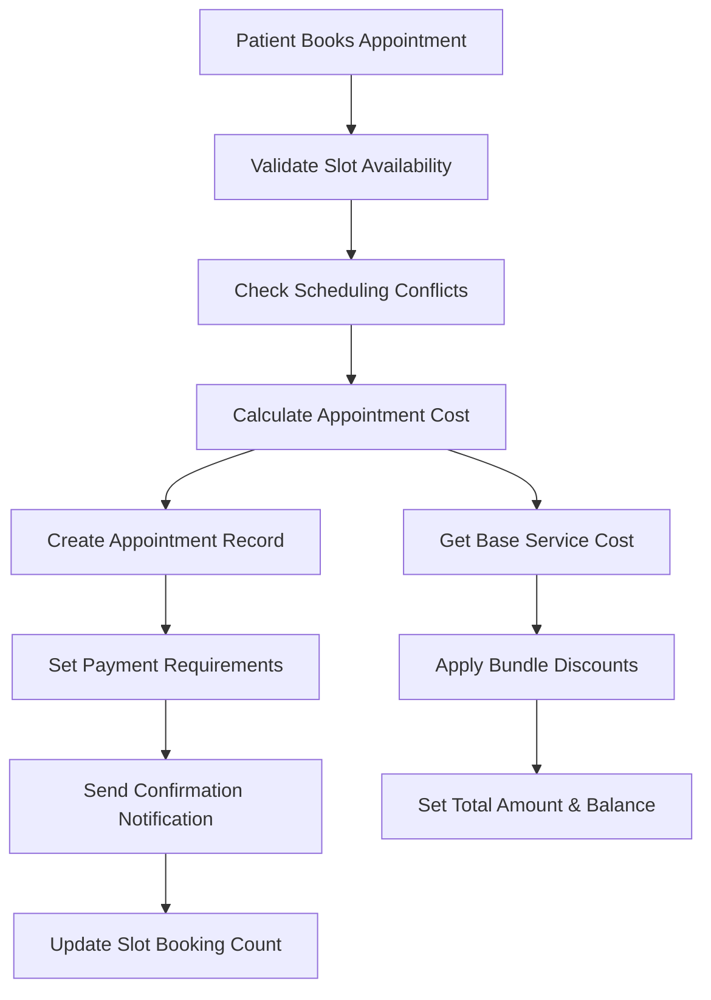
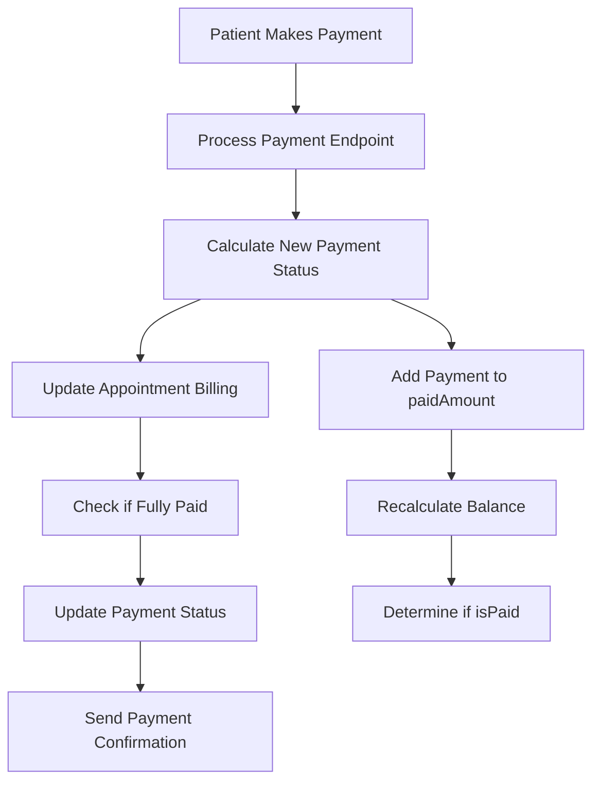
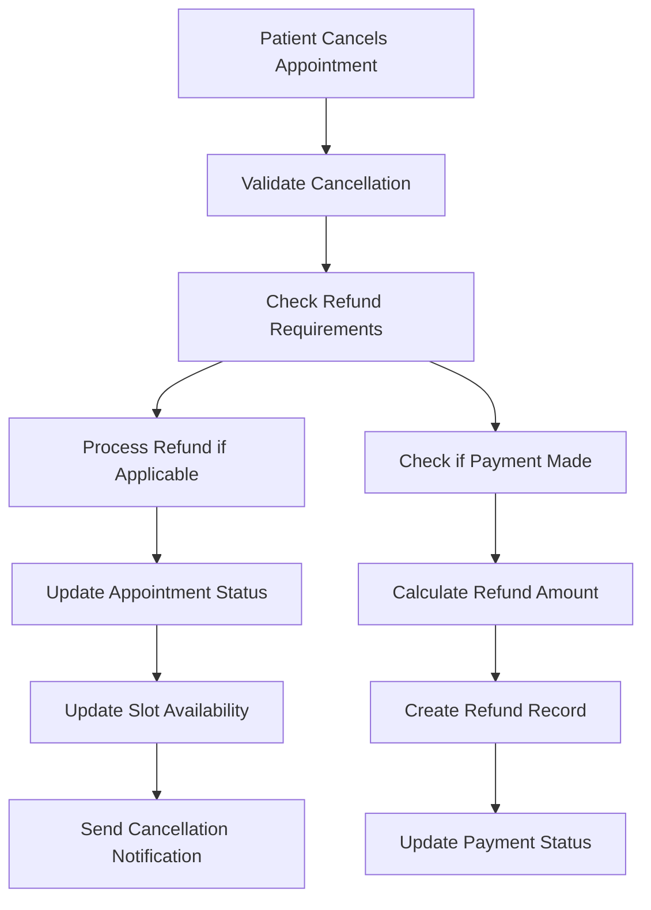
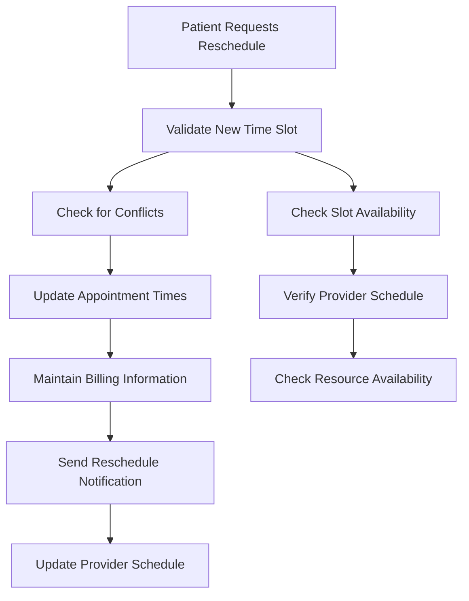
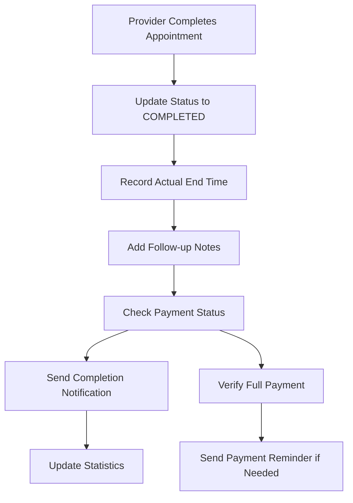

# Appointment Module Billing Implementation & Flows

## 🏥 **Billing Implementation Overview**

The appointments module implements a **comprehensive billing system** that integrates seamlessly with your unified hospital billing infrastructure. The system enforces a **"Payment Before Services"** policy and provides real-time cost calculation, payment tracking, and refund processing.

## 💰 **Billing Architecture**

### **1. Billing Fields in Appointment Model**

```typescript
// Core billing fields in Appointment model
totalAmount: Decimal; // Total appointment cost (calculated automatically)
paidAmount: Decimal; // Amount paid so far
balance: Decimal; // Remaining balance (totalAmount - paidAmount)
isPaid: Boolean; // Payment status (true when balance <= 0)
requiresPrePayment: Boolean; // Payment policy enforcement (default: true)
```

### **2. Billing Integration Methods**

```typescript
// Automatic cost calculation
private async calculateAppointmentCost(appointmentDto: CreateAppointmentDto): Promise<number>

// Service-based pricing lookup
private async getBaseServiceCost(appointmentType: AppointmentType): Promise<number>

// Refund processing
private async processRefund(appointmentId: string, amount: number): Promise<void>
```

### **3. Service Cost Mapping**

```typescript
// Appointment types mapped to service categories
const serviceCategoryMap = {
  GENERAL_CONSULTATION: 'CONSULTATION',
  SPECIALIST_CONSULTATION: 'SPECIALIST',
  LAB_TEST: 'LABORATORY',
  IMAGING: 'IMAGING',
  SURGERY: 'SURGERY',
  FOLLOW_UP: 'CONSULTATION',
  EMERGENCY: 'EMERGENCY',
  TELEMEDICINE: 'CONSULTATION',
  PREVENTIVE_CARE: 'PREVENTIVE',
};
```

## 🔄 **Core Module Flows**

### **Flow 1: Appointment Creation & Billing**



**Key Steps:**

1. **Slot Validation**: Check if requested time slot is available
2. **Conflict Detection**: Ensure no scheduling conflicts exist
3. **Cost Calculation**: Automatically determine appointment cost
4. **Payment Setup**: Initialize billing fields with payment requirements
5. **Record Creation**: Create appointment with full billing integration
6. **Notification**: Send confirmation with payment details

**Billing Integration Points:**

- `totalAmount` set to calculated cost
- `balance` initialized to total amount
- `requiresPrePayment` enforced (default: true)
- `isPaid` set to false initially

### **Flow 2: Payment Processing**



**Key Steps:**

1. **Payment Input**: Receive payment amount from patient
2. **Amount Calculation**: Add payment to existing `paidAmount`
3. **Balance Update**: Recalculate `balance` (totalAmount - paidAmount)
4. **Status Update**: Set `isPaid` based on balance
5. **Record Update**: Update appointment with new payment status

**API Endpoint:**

```typescript
@Post('payment')
async processPayment(@Body() paymentDto: ProcessPaymentDto): Promise<AppointmentResponse>
```

### **Flow 3: Appointment Cancellation & Refund**



**Key Steps:**

1. **Cancellation Validation**: Ensure appointment can be cancelled
2. **Refund Assessment**: Check if refund is required
3. **Refund Processing**: Create refund record and update billing
4. **Status Update**: Mark appointment as cancelled
5. **Slot Management**: Free up the time slot
6. **Notification**: Send cancellation and refund details

**Refund Processing:**

```typescript
// Create refund record
await this.prisma.refund.create({
  data: {
    patientId: appointment.patientId,
    amount,
    reason: 'Appointment cancellation',
    status: 'APPROVED',
    refundDate: new Date(),
  },
});

// Update appointment payment status
await this.prisma.appointment.update({
  where: { id: appointmentId },
  data: {
    paidAmount: { decrement: amount },
    balance: { increment: amount },
    isPaid: false,
  },
});
```

### **Flow 4: Appointment Rescheduling**



**Key Steps:**

1. **New Slot Validation**: Ensure new time is available
2. **Conflict Detection**: Check for scheduling conflicts
3. **Time Update**: Update scheduled start/end times
4. **Billing Preservation**: Maintain all payment information
5. **Notification**: Send reschedule confirmation

**Billing Impact:**

- No changes to payment amounts
- Billing status remains unchanged
- Payment requirements maintained

### **Flow 5: Appointment Completion**



**Key Steps:**

1. **Status Update**: Mark appointment as completed
2. **Time Recording**: Capture actual completion time
3. **Documentation**: Add follow-up notes and instructions
4. **Payment Verification**: Ensure full payment received
5. **Notification**: Send completion confirmation

## 🎯 **Billing Policy Enforcement**

### **Payment Before Services Policy**

```typescript
// Enforced through requiresPrePayment field
requiresPrePayment: Boolean @default(true)

// Payment status tracking
isPaid: Boolean @default(false)
balance: Decimal @default(0)
```

**Policy Implementation:**

1. **Default Setting**: All appointments require pre-payment
2. **Status Tracking**: Real-time payment status monitoring
3. **Balance Calculation**: Automatic balance updates
4. **Service Delivery**: Services only provided when payment complete

### **Dynamic Pricing System**

```typescript
// Service-based pricing
const service = await this.prisma.service.findFirst({
  where: {
    category: { name: { contains: category, mode: 'insensitive' } },
    isActive: true,
  },
  orderBy: { currentPrice: 'asc' },
});

return service ? Number(service.currentPrice) : 50.0; // Default cost
```

**Pricing Features:**

1. **Service Integration**: Pulls prices from existing service catalog
2. **Category Mapping**: Maps appointment types to service categories
3. **Dynamic Updates**: Reflects current service pricing
4. **Fallback Pricing**: Default cost when service not found

### **Bundle Discount Support**

```typescript
// Bundle discount application
if (appointmentDto.bundleId) {
  const bundle = await this.prisma.appointmentBundle.findUnique({
    where: { id: appointmentDto.bundleId },
  });

  if (bundle) {
    return Number(bundle.finalAmount);
  }
}
```

**Bundle Features:**

1. **Multi-Service Packages**: Consultation + Lab + Imaging
2. **Automatic Discounts**: Pre-configured bundle pricing
3. **Flexible Combinations**: Customizable service bundles
4. **Cost Optimization**: Reduced total cost for package deals

## 📊 **Payment Tracking & Reporting**

### **Real-Time Payment Status**

```typescript
// Payment status calculation
const newPaidAmount = Number(appointment.paidAmount) + paymentDto.amount;
const newBalance = Number(appointment.totalAmount) - newPaidAmount;
const isPaid = newBalance <= 0;
```

**Tracking Features:**

1. **Payment Progress**: Real-time amount tracking
2. **Balance Calculation**: Automatic balance updates
3. **Payment Status**: Boolean payment completion flag
4. **Audit Trail**: Complete payment history

### **Financial Reporting**

```typescript
// Appointment statistics with billing data
export interface AppointmentStatistics {
  totalAppointments: number;
  totalRevenue: number;
  pendingPayments: number;
  averageAppointmentCost: number;
  paymentCompletionRate: number;
}
```

**Reporting Capabilities:**

1. **Revenue Tracking**: Total appointment revenue
2. **Payment Analytics**: Payment completion rates
3. **Outstanding Balances**: Pending payment amounts
4. **Cost Analysis**: Average appointment costs

## 🔧 **Technical Implementation Details**

### **Database Schema Integration**

```sql
-- Appointment billing fields
CREATE TABLE appointments (
  id VARCHAR(255) PRIMARY KEY,
  totalAmount DECIMAL(10,2) DEFAULT 0,
  paidAmount DECIMAL(10,2) DEFAULT 0,
  balance DECIMAL(10,2) DEFAULT 0,
  isPaid BOOLEAN DEFAULT FALSE,
  requiresPrePayment BOOLEAN DEFAULT TRUE,
  -- ... other fields
);
```

### **Service Layer Integration**

```typescript
// Billing service integration points
private async calculateAppointmentCost(appointmentDto: CreateAppointmentDto): Promise<number>
private async getBaseServiceCost(appointmentType: AppointmentType): Promise<number>
private async processRefund(appointmentId: string, amount: number): Promise<void>
```

### **API Endpoint Integration**

```typescript
// Payment processing endpoint
@Post('payment')
async processPayment(@Body() paymentDto: ProcessPaymentDto): Promise<AppointmentResponse>

// Billing status updates
@Patch(':id')
async updateAppointment(@Param('id') id: string, @Body() updateDto: UpdateAppointmentDto)
```

## 🚀 **Benefits of This Implementation**

### **For Patients:**

1. **Transparent Pricing**: Clear cost breakdown before booking
2. **Flexible Payment**: Multiple payment options and installments
3. **Automatic Refunds**: Seamless cancellation and refund processing
4. **Payment Tracking**: Real-time payment status updates

### **For Providers:**

1. **Payment Assurance**: Services only provided when payment complete
2. **Revenue Tracking**: Real-time financial performance monitoring
3. **Bundle Optimization**: Multi-service appointment packages
4. **Schedule Management**: Efficient resource utilization

### **For Administrators:**

1. **Financial Control**: Payment before services policy enforcement
2. **Revenue Management**: Comprehensive billing and payment tracking
3. **Service Optimization**: Data-driven service pricing
4. **Audit Compliance**: Complete financial audit trail

## 🔮 **Future Enhancements**

### **Planned Billing Features:**

1. **Payment Gateway Integration**: Credit card, mobile money, insurance
2. **Installment Plans**: Flexible payment scheduling
3. **Insurance Integration**: Automatic insurance claim processing
4. **Advanced Analytics**: Predictive pricing and revenue optimization
5. **Multi-Currency Support**: International patient billing

This billing implementation provides a **robust, scalable foundation** for hospital appointment management while maintaining full integration with your existing unified billing system and enforcing your payment policies.
