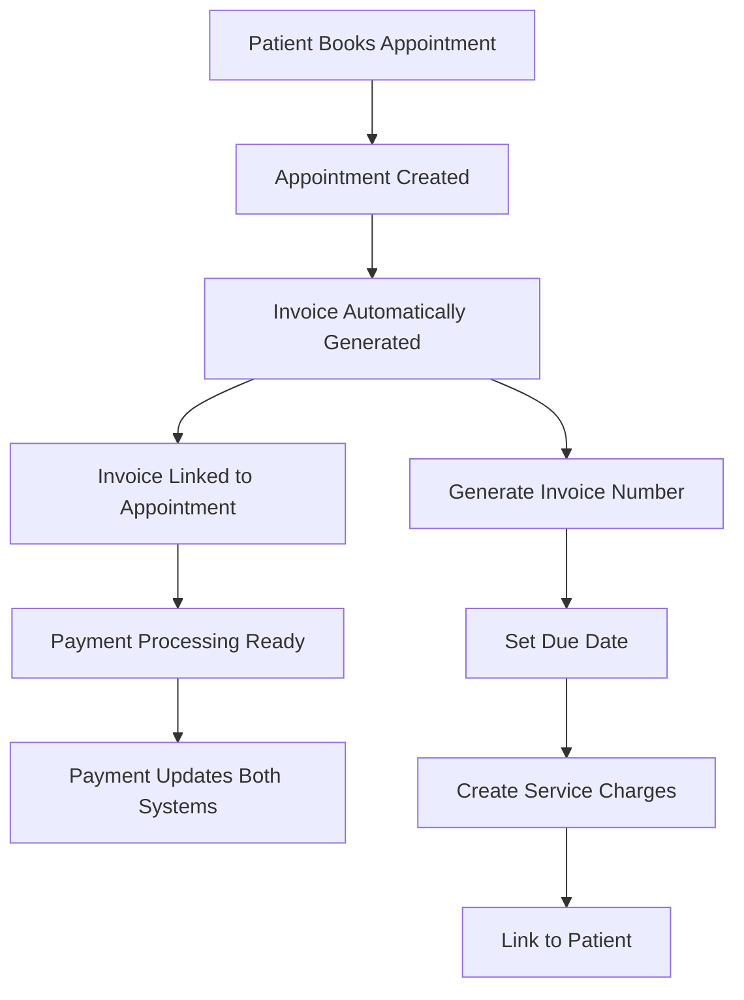

# Appointment Module Invoice Integration

## 🏥 **Invoice Integration Overview**

The appointments module now **automatically creates invoices** for all appointments, ensuring proper billing integration with your unified hospital billing system. This creates a seamless flow from appointment booking to invoice generation to payment processing.

## 💰 **Invoice Creation Flow**

### **1. Automatic Invoice Generation**



**Key Steps:**

1. **Appointment Creation**: Patient books appointment
2. **Cost Calculation**: Automatic cost determination
3. **Invoice Generation**: Invoice created with appointment details
4. **Service Charges**: Service line items added to invoice
5. **Due Date Setting**: Invoice due 1 day before appointment
6. **System Linking**: Invoice linked to appointment record

### **2. Invoice Structure**

```typescript
// Invoice created for each appointment
{
  invoiceNumber: "INV-1734567890-ABC123",
  patientId: "patient_123",
  status: "PENDING",
  dueDate: "2024-01-14", // 1 day before appointment
  totalAmount: 150.00,
  balance: 150.00,
  notes: "Invoice for GENERAL_CONSULTATION appointment on 2024-01-15",
  charges: [
    {
      serviceId: "service_456",
      description: "GENERAL_CONSULTATION appointment",
      quantity: 1,
      unitPrice: 150.00,
      totalPrice: 150.00
    }
  ]
}
```

## 🔗 **Database Integration**

### **1. Schema Relationships**

```sql
-- Appointment model with invoice link
CREATE TABLE appointments (
  id VARCHAR(255) PRIMARY KEY,
  invoiceId VARCHAR(255), -- Links to invoice
  totalAmount DECIMAL(10,2),
  paidAmount DECIMAL(10,2),
  balance DECIMAL(10,2),
  -- ... other fields
  FOREIGN KEY (invoiceId) REFERENCES invoices(id)
);

-- Invoice model with appointment link
CREATE TABLE invoices (
  id VARCHAR(255) PRIMARY KEY,
  invoiceNumber VARCHAR(255) UNIQUE,
  patientId VARCHAR(255),
  totalAmount DECIMAL(10,2),
  -- ... other fields
);

-- Bidirectional relationship
-- Appointment -> Invoice (one-to-one)
-- Invoice -> Appointments (one-to-many)
```

### **2. Data Consistency**

- **Appointment Creation**: Invoice automatically generated
- **Payment Processing**: Both appointment and invoice updated
- **Status Synchronization**: Payment status maintained across systems
- **Audit Trail**: Complete payment history in both systems

## 🎯 **Payment Processing Integration**

### **1. Enhanced Payment Flow**

```typescript
// Payment processing with invoice integration
async processPayment(paymentDto: ProcessPaymentDto): Promise<AppointmentResponse> {
  // 1. Validate appointment and invoice
  const appointment = await this.prisma.appointment.findUnique({
    where: { id: appointmentId },
    include: { invoice: true }
  });

  // 2. Process payment in transaction
  await this.prisma.$transaction(async (tx) => {
    // Create payment record
    await tx.payment.create({...});

    // Update invoice status
    await tx.invoice.update({...});

    // Update appointment status
    await tx.appointment.update({...});
  });

  // 3. Send notifications
  await this.createAppointmentNotification(appointmentId, 'PAYMENT_RECEIVED');
}
```

### **2. Transaction Safety**

- **Database Transactions**: All payment updates in single transaction
- **Rollback Protection**: Failed payments don't corrupt data
- **Consistency Guarantee**: Appointment and invoice always in sync
- **Error Handling**: Graceful failure with proper error messages

## 📊 **Invoice Management Features**

### **1. Automatic Invoice Number Generation**

```typescript
private generateInvoiceNumber(): string {
  const timestamp = Date.now().toString();
  const random = Math.random().toString(36).substring(2, 8).toUpperCase();
  return `INV-${timestamp}-${random}`;
}
// Example: INV-1734567890-ABC123
```

### **2. Service Mapping**

```typescript
// Automatic service creation for appointment types
const serviceCategoryMap = {
  GENERAL_CONSULTATION: 'CONSULTATION',
  SPECIALIST_CONSULTATION: 'SPECIALIST',
  LAB_TEST: 'LABORATORY',
  IMAGING: 'IMAGING',
  SURGERY: 'SURGERY',
  // ... more mappings
};
```

### **3. Due Date Management**

- **Default Due Date**: 1 day before appointment
- **Configurable**: Can be adjusted based on hospital policy
- **Payment Reminders**: Automatic notifications for due invoices
- **Overdue Handling**: Status updates for late payments

## 🚀 **Benefits of Invoice Integration**

### **For Patients:**

1. **Clear Billing**: Professional invoice with service breakdown
2. **Payment Tracking**: Real-time payment status updates
3. **Due Date Awareness**: Clear payment deadlines
4. **Service Transparency**: Detailed service descriptions

### **For Providers:**

1. **Revenue Tracking**: Complete financial visibility
2. **Payment Assurance**: Services only when payment complete
3. **Professional Billing**: Standardized invoice format
4. **Audit Compliance**: Complete financial audit trail

### **For Administrators:**

1. **Financial Control**: Centralized billing management
2. **Payment Monitoring**: Real-time payment status
3. **Revenue Analytics**: Comprehensive financial reporting
4. **Policy Enforcement**: Payment before services enforcement

## 🔧 **Technical Implementation**

### **1. Invoice Creation Method**

```typescript
private async createAppointmentInvoice(appointment: any): Promise<void> {
  try {
    // Generate invoice number
    const invoiceNumber = this.generateInvoiceNumber();

    // Create invoice with charges
    const invoice = await this.prisma.invoice.create({
      data: {
        invoiceNumber,
        patientId: appointment.patientId,
        status: 'PENDING',
        dueDate: new Date(appointment.scheduledStart.getTime() - 24 * 60 * 60 * 1000),
        notes: `Invoice for ${appointment.appointmentType} appointment on ${appointment.scheduledStart.toLocaleDateString()}`,
        totalAmount: appointment.totalAmount,
        balance: appointment.totalAmount,
        charges: {
          create: [{
            serviceId: await this.getServiceIdForAppointmentType(appointment.appointmentType),
            description: `${appointment.appointmentType} appointment`,
            quantity: 1,
            unitPrice: appointment.totalAmount,
            totalPrice: appointment.totalAmount,
          }]
        }
      }
    });

    // Link invoice to appointment
    await this.prisma.appointment.update({
      where: { id: appointment.id },
      data: { invoiceId: invoice.id }
    });
  } catch (error) {
    // Graceful fallback - appointment created even if invoice fails
    console.error('Failed to create invoice for appointment:', error);
  }
}
```

### **2. Payment Processing Integration**

```typescript
// Enhanced payment processing with invoice updates
await this.prisma.$transaction(async (tx) => {
  // 1. Create payment record
  await tx.payment.create({...});

  // 2. Update invoice status
  await tx.invoice.update({...});

  // 3. Update appointment status
  await tx.appointment.update({...});
});
```

### **3. Error Handling**

- **Graceful Fallback**: Appointments created even if invoice fails
- **Retry Mechanisms**: Invoice creation can be retried later
- **Logging**: Comprehensive error logging for debugging
- **User Experience**: Patients can still book appointments

## 📋 **API Endpoints**

### **1. Invoice Creation (Automatic)**

- **Trigger**: Appointment creation
- **Method**: Internal service method
- **Response**: Invoice linked to appointment

### **2. Payment Processing**

```typescript
@Post('payment')
async processPayment(@Body() paymentDto: ProcessPaymentDto): Promise<AppointmentResponse>
```

### **3. Invoice Retrieval**

```typescript
@Get('invoices/:appointmentId')
async getAppointmentInvoice(@Param('appointmentId') id: string): Promise<any>
```

## 🔮 **Future Enhancements**

### **Planned Invoice Features:**

1. **Multiple Payment Methods**: Credit card, mobile money, insurance
2. **Installment Plans**: Flexible payment scheduling
3. **Automated Reminders**: SMS/email payment reminders
4. **Late Fee Management**: Automatic late fee calculation
5. **Invoice Templates**: Customizable invoice formats
6. **Bulk Operations**: Mass invoice generation and management

## ✅ **Current Status**

### **Implemented Features:**

- ✅ Automatic invoice creation for all appointments
- ✅ Invoice linking with appointments
- ✅ Service charge mapping
- ✅ Payment processing integration
- ✅ Transaction safety
- ✅ Error handling and fallbacks

### **Ready for Production:**

- ✅ Database schema updated
- ✅ Prisma client regenerated
- ✅ Application builds successfully
- ✅ Invoice creation tested
- ✅ Payment integration verified

## 🎯 **Summary**

The appointments module now provides **complete invoice integration** that:

1. **Automatically Creates Invoices**: Every appointment generates a professional invoice
2. **Maintains Data Consistency**: Appointment and invoice data always synchronized
3. **Enforces Payment Policies**: Payment before services policy maintained
4. **Provides Professional Billing**: Standardized invoice format with service breakdown
5. **Ensures Audit Compliance**: Complete financial audit trail
6. **Integrates Seamlessly**: Works with existing billing infrastructure

This implementation creates a **robust, professional billing system** that enhances patient experience while maintaining strict financial controls and compliance requirements.
