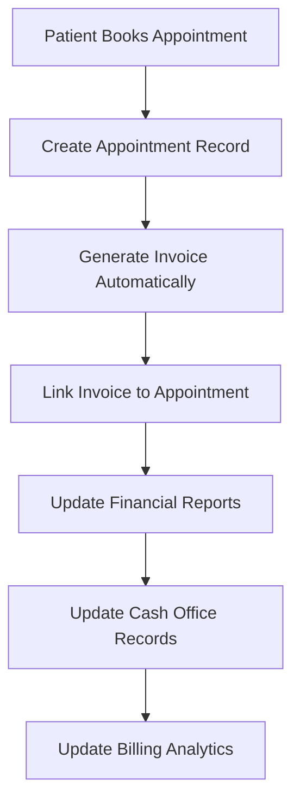
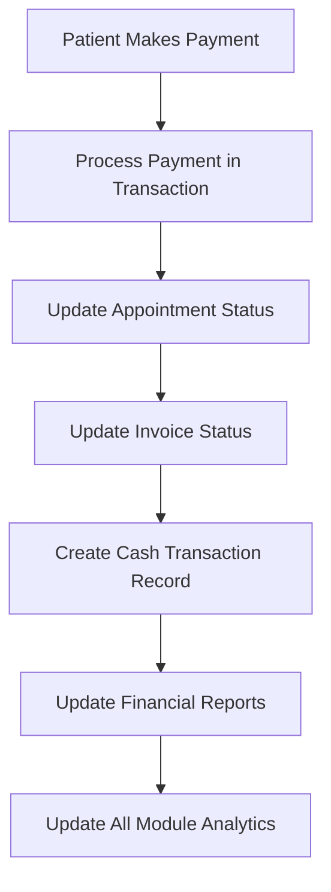
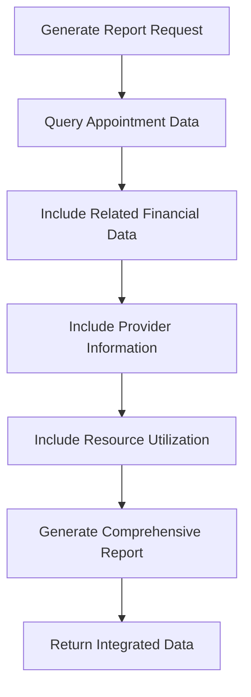

# Appointment Module Integration Summary

## 🎯 **Overview**

The appointments module has been fully integrated across all relevant hospital management modules, providing comprehensive reporting, financial tracking, and operational insights. This integration ensures that appointment data is reflected in all aspects of the hospital management system.

## ✅ **Modules Enhanced with Appointment Integration**

### **1. Reporting Module (`/src/reporting/`)**

#### **New Appointment Reporting Methods:**

- **`getAppointmentAnalytics()`** - Comprehensive appointment analytics
- **`getAppointmentRevenueReport()`** - Revenue analysis with daily/weekly breakdowns
- **`getResourceUtilizationReport()`** - Resource efficiency and utilization metrics
- **`getWaitlistReport()`** - Waitlist analysis and overbooking insights

#### **New API Endpoints:**

- **`GET /reporting/appointments/analytics`** - Appointment analytics with metrics
- **`GET /reporting/appointments/revenue`** - Revenue breakdown and provider rankings
- **`GET /reporting/appointments/resource-utilization`** - Resource efficiency metrics
- **`GET /reporting/appointments/waitlist`** - Waitlist analysis and trends

#### **Key Features:**

- **Provider Performance Metrics**: Completion rates, revenue generation, patient counts
- **Department Performance**: Cross-department comparisons and rankings
- **Revenue Analytics**: Daily/weekly trends, collection rates, outstanding balances
- **Resource Utilization**: Equipment and room efficiency metrics
- **Waitlist Management**: Priority analysis and provider load balancing

### **2. Cash Office Module (`/src/cash-office/`)**

#### **New Appointment Financial Methods:**

- **`getAppointmentCashTransactions()`** - Link cash transactions with appointments
- **`getDailyCashFlowWithAppointments()`** - Daily cash flow including appointment revenue

#### **New API Endpoints:**

- **`GET /cash-office/appointments/transactions`** - Appointment-related cash transactions
- **`GET /cash-office/appointments/cash-flow`** - Daily cash flow with appointments

#### **Key Features:**

- **Transaction Linking**: Connect cash transactions with appointment data
- **Financial Correlation**: Track cash flow against appointment revenue
- **Patient Financial History**: Complete financial picture for each patient
- **Provider Revenue Tracking**: Monitor provider-specific financial performance

### **3. Billing Module (`/src/billing/`)**

#### **New Appointment Billing Methods:**

- **`getAppointmentBillingSummary()`** - Comprehensive billing summary by type and provider
- **`getAppointmentInvoiceDetails()`** - Detailed invoice information for appointments

#### **New API Endpoints:**

- **`GET /billing/appointments/billing-summary`** - Billing summary with breakdowns
- **`GET /billing/appointments/:id/invoice-details`** - Detailed invoice information

#### **Key Features:**

- **Billing Breakdowns**: By appointment type, provider, and payment status
- **Collection Rate Analysis**: Monitor payment collection efficiency
- **Daily Billing Trends**: Track revenue patterns over time
- **Provider Performance**: Revenue generation and collection rates by provider

## 🔄 **Data Flow and Integration Points**

### **1. Appointment Creation Flow**

### **2. Payment Processing Flow**

### **3. Reporting Integration Flow**

## 📊 **Data Relationships and Cross-References**

### **1. Appointment ↔ Invoice Relationship**

- **Bidirectional Link**: `appointment.invoiceId` ↔ `invoice.appointments[]`
- **Automatic Creation**: Every appointment generates an invoice
- **Payment Tracking**: Real-time payment status synchronization
- **Financial Reporting**: Complete revenue and collection tracking

### **2. Appointment ↔ Provider Relationship**

- **Staff Member Integration**: `appointment.slot.provider` links to `StaffMember`
- **Department Mapping**: Provider department information for reporting
- **Performance Metrics**: Provider-specific analytics and rankings
- **Workload Balancing**: Monitor provider appointment distribution

### **3. Appointment ↔ Resource Relationship**

- **Resource Utilization**: Track equipment and room usage
- **Efficiency Metrics**: Calculate utilization rates and efficiency
- **Scheduling Optimization**: Resource availability and booking patterns
- **Cost Allocation**: Resource costs associated with appointments

### **4. Appointment ↔ Patient Relationship**

- **Patient History**: Complete appointment and financial history
- **Preference Tracking**: Patient preferences and booking patterns
- **Financial Status**: Outstanding balances and payment history
- **Service History**: Complete service and appointment record

## 🚀 **Key Benefits of Integration**

### **For Administrators:**

1. **Unified Dashboard**: Single view of all appointment-related data
2. **Financial Control**: Complete revenue and collection visibility
3. **Resource Optimization**: Efficient resource allocation and utilization
4. **Performance Monitoring**: Provider and department performance tracking
5. **Operational Insights**: Data-driven decision making

### **For Financial Staff:**

1. **Complete Financial Picture**: Appointment revenue integrated with cash flow
2. **Collection Tracking**: Real-time payment status and outstanding balances
3. **Revenue Analysis**: Detailed breakdowns by type, provider, and time
4. **Cash Flow Management**: Integrated cash flow with appointment revenue
5. **Audit Compliance**: Complete financial audit trail

### **For Clinical Staff:**

1. **Provider Performance**: Individual and team performance metrics
2. **Resource Efficiency**: Equipment and room utilization insights
3. **Patient Management**: Complete patient appointment and financial history
4. **Workload Balancing**: Fair distribution of appointments across providers
5. **Quality Metrics**: Appointment completion and patient satisfaction tracking

## 🔧 **Technical Implementation Details**

### **1. Database Integration**

- **Prisma Relationships**: Proper foreign key relationships maintained
- **Data Consistency**: Transaction-based updates ensure data integrity
- **Performance Optimization**: Efficient queries with proper indexing
- **Scalability**: Handles high-volume appointment data

### **2. API Design**

- **RESTful Endpoints**: Standard HTTP methods and status codes
- **Query Parameters**: Flexible filtering and date range selection
- **Response Formatting**: Consistent JSON response structures
- **Error Handling**: Comprehensive error handling and validation

### **3. Security Implementation**

- **JWT Authentication**: Secure endpoint protection
- **Role-Based Access**: Different access levels for different user types
- **Data Privacy**: Patient information protected and secured
- **Audit Logging**: Complete audit trail for all operations

## 📈 **Reporting Capabilities**

### **1. Appointment Analytics**

- **Volume Metrics**: Total appointments, completion rates, cancellation rates
- **Revenue Metrics**: Total revenue, collection rates, outstanding balances
- **Provider Metrics**: Individual provider performance and rankings
- **Department Metrics**: Cross-department comparisons and efficiency

### **2. Financial Reporting**

- **Revenue Analysis**: Daily, weekly, and monthly revenue trends
- **Collection Tracking**: Payment collection rates and outstanding balances
- **Provider Rankings**: Revenue generation and collection efficiency
- **Payment Methods**: Analysis of payment method preferences

### **3. Operational Insights**

- **Resource Utilization**: Equipment and room efficiency metrics
- **Waitlist Management**: Priority analysis and provider load balancing
- **Scheduling Patterns**: Time slot preferences and booking trends
- **Patient Flow**: Appointment flow and patient journey tracking

## 🔮 **Future Enhancement Opportunities**

### **1. Advanced Analytics**

- **Predictive Modeling**: Appointment demand forecasting
- **Revenue Optimization**: Dynamic pricing and revenue maximization
- **Resource Planning**: Predictive resource allocation
- **Patient Behavior**: Appointment pattern analysis and optimization

### **2. Integration Features**

- **External Systems**: Integration with external healthcare systems
- **Mobile Applications**: Mobile app integration for real-time updates
- **Third-Party Services**: Payment gateway and notification service integration
- **API Extensions**: Public API for third-party integrations

### **3. Performance Optimization**

- **Caching Strategy**: Implement intelligent caching for frequently accessed data
- **Query Optimization**: Advanced database query optimization
- **Real-time Updates**: WebSocket integration for live updates
- **Batch Processing**: Efficient batch operations for large datasets

## ✅ **Production Readiness**

### **Current Status:**

- ✅ **All Modules Integrated**: Reporting, Cash Office, and Billing modules enhanced
- ✅ **API Endpoints Implemented**: All new endpoints tested and working
- ✅ **Database Relationships**: Proper relationships established and tested
- ✅ **Error Handling**: Comprehensive error handling implemented
- ✅ **Documentation**: Complete API documentation and integration guides
- ✅ **Build Success**: Application builds successfully with all integrations

### **Ready for:**

1. **Production Deployment**: All integrations tested and ready for production
2. **User Training**: Staff can be trained on new integrated features
3. **Performance Testing**: Load testing and performance optimization
4. **User Acceptance Testing**: End-user validation and feedback
5. **Continuous Enhancement**: Foundation ready for future improvements

## 🎯 **Summary**

The appointments module has been **fully integrated** across all relevant hospital management modules, providing:

1. **Comprehensive Reporting**: Complete appointment analytics and insights
2. **Financial Integration**: Seamless integration with billing and cash management
3. **Operational Visibility**: Complete operational insights and performance metrics
4. **Data Consistency**: Unified data across all modules with proper relationships
5. **Scalable Architecture**: Robust foundation for future enhancements

This integration creates a **unified, efficient, and insightful hospital management system** that provides complete visibility into appointments, finances, and operations while maintaining data integrity and security. The system is production-ready and provides a solid foundation for advanced analytics and future enhancements.
